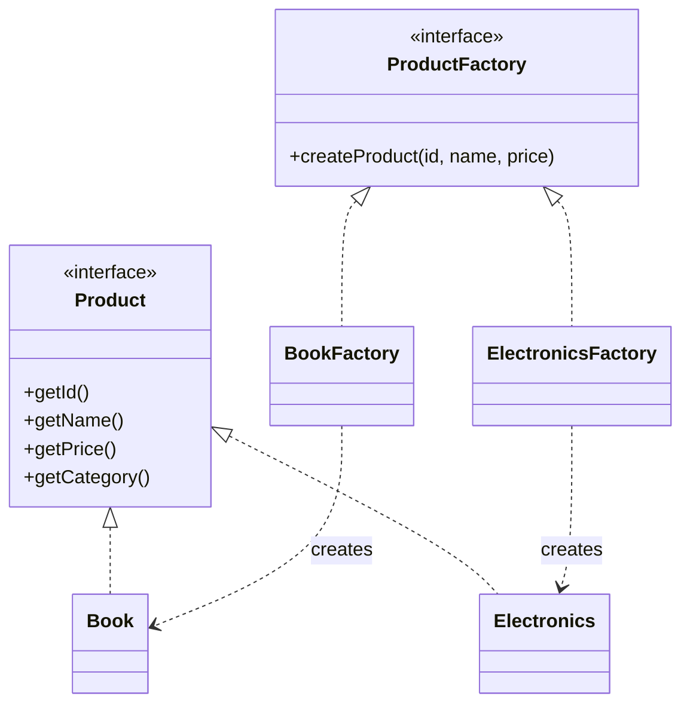
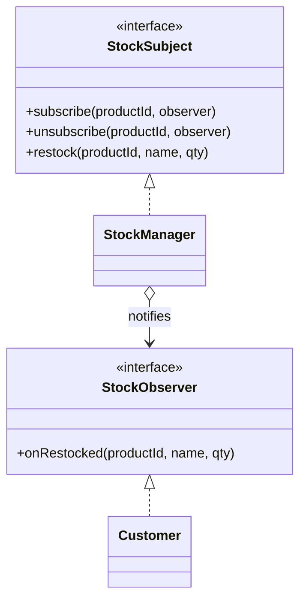

# Shopping Cart System (Java 17)

This sample project demonstrates two design patterns in a realistic e-commerce scenario:

- **Factory Method** for product creation (`Book`, `Electronics`)
- **Observer** for stock restock notifications to subscribed customers

## Project Structure

- `src/main/java/com/oodpp/shopping/factory` → Factory Method implementation
- `src/main/java/com/oodpp/shopping/product` → Product abstractions and concrete products
- `src/main/java/com/oodpp/shopping/stock` → Observer interfaces and subject (`StockManager`)
- `src/main/java/com/oodpp/shopping/customer` → Customer observer
- `src/main/java/com/oodpp/shopping/cart` → Cart logic and checkout summary
- `src/main/java/com/oodpp/shopping/Main.java` → Demo runner
- `src/test/java/com/oodpp/shopping/ShoppingCartSystemTest.java` → JUnit tests

## How to Run

### 1) Run tests

```powershell
mvn test
```

### 2) Run demo app

```powershell
mvn exec:java
```

## Interactive Demo Flow (for screenshots)

When the app runs, it asks for input in this sequence:

1. Choose `1` (Book), `2` (Electronics), or `3` (Checkout)
2. Enter product details (`ID`, `name`, `price`)
3. Optionally subscribe a customer for restock alerts (`yes/no` + name)
4. Repeat adding products, then choose `3` to checkout
5. Optionally trigger restock notifications (`yes/no`)

Suggested screenshot points:

- Menu + product entry prompts
- Checkout Summary section
- Stock Notifications section

## UML (Factory Method)



## UML (Observer)



## Part B – Software Application and Demonstration (~500 words)

The sample application is a **Shopping Cart System** developed in Java 17 to model a common e-commerce workflow: users select products, add them to a cart, and proceed to checkout. In addition, the system includes a stock notification feature that allows customers to subscribe to updates for out-of-stock items and receive alerts when those items are restocked. The project was built in IntelliJ IDEA and version-controlled with GitHub, making it suitable for both implementation and demonstration. Because online shopping is a familiar domain, it provides a practical context for demonstrating object-oriented design patterns with clear business value.

Two patterns were implemented: **Factory Method** (creational) and **Observer** (behavioral). Factory Method is used in the product-creation layer through a `ProductFactory` abstraction, with concrete factories such as `BookFactory` and `ElectronicsFactory`. Client code requests products through the factory interface rather than constructing concrete classes directly. This encapsulates instantiation logic and keeps product creation open for extension. If a new category (for example, groceries or clothing) is needed, developers can add a new product class and factory without changing existing client workflows. UML diagrams in this repository illustrate the relation between the abstract creator, concrete creators, and product hierarchy.

The Observer pattern is applied in stock management. `StockManager` acts as the subject, while `Customer` implements the observer interface. Customers can subscribe to specific product IDs, and when restocking occurs, the subject broadcasts notifications to all registered observers. This design supports dynamic one-to-many communication and models realistic notification behavior seen in modern online stores. The implementation demonstrates registration, notification delivery, and quantity updates in a decoupled way. During execution, multiple customers can subscribe to the same item and receive independent alerts, which is reflected in console output and test cases.

Two key advantages were observed. First, **maintainability** improved because Factory Method isolated object creation from usage, reducing ripple effects when extending product categories. Second, **separation of concerns** improved through Observer, as stock tracking logic remains independent of customer-facing notification behavior. This makes each module easier to reason about, test, and evolve.

The project also revealed two practical limitations. One is **increased structural complexity**: introducing factories and observer interfaces adds more classes than a direct implementation, which can be excessive for very small systems. The other is a **learning curve for beginners**: understanding interfaces, subscription lifecycles, and event-style interactions requires stronger OOP fundamentals. During development, managing multiple subscribers highlighted the need for careful API design to avoid unintended notification behavior.

In conclusion, this Shopping Cart System demonstrates that design patterns are most valuable when aligned with real architectural needs. Factory Method provides scalable, flexible product creation, while Observer enables responsive and decoupled communication for restock events. Although these patterns add some upfront complexity, the gains in extensibility, clarity, and maintainability justify their use in realistic applications.
